# 儿童 AI 英语眼镜数据库设计（第一版）

## 1. 设计前提

这份数据库设计用于支撑以下 3 类调用方：

1. 家长端 APP
2. 眼镜设备固件
3. Web 管理后台

本版设计基于以下假设：

- 主数据库使用 `PostgreSQL`
- 缓存和短时队列使用 `Redis`
- 固件包、内容包、日志文件使用对象存储
- 原始照片和原始对讲音频默认不在服务端长期存储，仅保存必要元数据，尽量符合儿童隐私最小化原则
- 所有时间字段统一使用 `timestamptz`，数据库内部统一保存 `UTC`
- 主键统一使用 `uuid`
- 大部分状态字段先用 `varchar(32)`/`varchar(64)`，避免早期使用 PostgreSQL enum 导致频繁迁移

## 2. 存储分层建议

### 2.1 PostgreSQL

存放结构化业务数据：

- 用户与登录态
- 孩子资料
- 设备与绑定关系
- 管控策略与指令记录
- 学习数据与报告
- 内容与固件发布记录
- 工单、日志元数据、审计日志

### 2.2 Redis

存放短期和高频状态：

- 短信验证码
- 登录态黑名单
- 设备待执行指令队列缓存
- OTA 进度热点缓存
- 限流计数器
- 报表导出异步任务状态

### 2.3 对象存储

建议 bucket：

- `firmware-packages`
- `content-packages`
- `support-logs`
- `report-exports`

说明：

- 若后续业务决定将拍照文件云端备份，再新增 `photo-backups` bucket。
- 当前文档强调照片和语音优先本地传输，因此第一版不要默认上云存原始媒体。

## 3. 命名与通用约定

- 表名统一 `snake_case` 复数形式
- 主键字段统一为 `id`
- 外键字段命名为 `<entity>_id`
- 创建时间统一 `created_at`
- 更新时间统一 `updated_at`
- 软删除统一 `deleted_at`
- 需要幂等的写接口统一保留 `idempotency_key` 或 `batch_id`
- 灵活结构统一使用 `jsonb`，避免为高变化字段过早拆太细

## 4. 核心关系

```mermaid
erDiagram
  users ||--o{ child_profiles : owns
  users ||--o{ device_bindings : binds
  devices ||--o{ device_bindings : bound_by
  devices ||--o{ device_status_snapshots : reports
  devices ||--|| device_policies : has
  devices ||--o{ device_commands : receives
  devices ||--o{ firmware_upgrade_tasks : upgrades
  devices ||--o{ learning_daily_stats : aggregates
  devices ||--o{ learning_word_records : produces
  devices ||--o{ reading_practice_records : produces
  devices ||--o{ photo_records : captures
  devices ||--o{ intercom_records : calls
  users ||--o{ learning_reports : views
  users ||--o{ feedback_tickets : submits
  admin_users ||--o{ audit_logs : writes
  firmware_packages ||--o{ firmware_release_jobs : released_as
  content_packages ||--o{ content_releases : released_as
```

## 5. PostgreSQL 详细表设计

## 5.1 用户与认证域

### `users`

核心字段：

- `id uuid pk`
- `phone varchar(20) not null unique`
- `phone_country_code varchar(8) not null default '+86'`
- `status varchar(32) not null default 'active'`
- `last_login_at timestamptz null`
- `current_device_id uuid null`
- `created_at timestamptz not null`
- `updated_at timestamptz not null`
- `deleted_at timestamptz null`

索引建议：

- `uk_users_phone(phone)`
- `idx_users_status_created_at(status, created_at desc)`

说明：

- 本项目无需实名字段，第一版不设计身份证、真实姓名等敏感信息字段。

### `user_agreement_acceptances`

核心字段：

- `id uuid pk`
- `user_id uuid not null`
- `user_agreement_version varchar(32) not null`
- `privacy_policy_version varchar(32) not null`
- `child_privacy_version varchar(32) not null`
- `accepted_at timestamptz not null`
- `client_platform varchar(16) not null`
- `client_version varchar(32) not null`

索引建议：

- `idx_agreements_user_id(user_id, accepted_at desc)`

### `user_sessions`

核心字段：

- `id uuid pk`
- `user_id uuid not null`
- `refresh_token_hash varchar(255) not null`
- `platform varchar(16) not null`
- `device_model varchar(128) null`
- `app_version varchar(32) null`
- `ip_address varchar(64) null`
- `expires_at timestamptz not null`
- `revoked_at timestamptz null`
- `created_at timestamptz not null`

索引建议：

- `idx_sessions_user_id(user_id, created_at desc)`
- `idx_sessions_expires_at(expires_at)`

### `child_profiles`

核心字段：

- `id uuid pk`
- `user_id uuid not null`
- `nickname varchar(32) not null`
- `age smallint null`
- `learning_stage varchar(32) null`
- `created_at timestamptz not null`
- `updated_at timestamptz not null`

索引建议：

- `uk_child_profiles_user_id(user_id)`

### `push_tokens`

核心字段：

- `id uuid pk`
- `user_id uuid not null`
- `platform varchar(32) not null`
- `push_token varchar(512) not null`
- `app_version varchar(32) null`
- `device_model varchar(128) null`
- `last_seen_at timestamptz not null`
- `is_active boolean not null default true`

索引建议：

- `uk_push_tokens_platform_token(platform, push_token)`
- `idx_push_tokens_user_id(user_id, is_active)`

## 5.2 设备与绑定域

### `devices`

核心字段：

- `id uuid pk`
- `device_sn varchar(64) null unique`
- `bluetooth_mac varchar(32) not null unique`
- `wifi_mac varchar(32) null`
- `model_code varchar(16) not null`
- `device_name varchar(64) null`
- `firmware_version varchar(64) null`
- `activation_at timestamptz null`
- `last_online_at timestamptz null`
- `status varchar(32) not null default 'inactive'`
- `created_at timestamptz not null`
- `updated_at timestamptz not null`

索引建议：

- `uk_devices_bluetooth_mac(bluetooth_mac)`
- `idx_devices_model_status(model_code, status)`
- `idx_devices_last_online_at(last_online_at desc)`

### `device_bindings`

核心字段：

- `id uuid pk`
- `device_id uuid not null`
- `user_id uuid not null`
- `binding_status varchar(32) not null default 'active'`
- `is_controller boolean not null default true`
- `remark_name varchar(64) null`
- `bound_at timestamptz not null`
- `unbound_at timestamptz null`
- `unbind_reason varchar(64) null`

索引建议：

- `idx_bindings_user_id_status(user_id, binding_status)`
- `idx_bindings_device_id_status(device_id, binding_status)`
- 部分唯一索引：`uniq_active_controller_per_device(device_id) where binding_status = 'active' and is_controller = true`

说明：

- 文档要求“最后绑定的手机拥有唯一管控权限”，因此控制权通过该表约束实现。

### `device_status_snapshots`

核心字段：

- `id uuid pk`
- `device_id uuid not null`
- `online_status varchar(32) not null`
- `battery_level smallint null`
- `battery_state varchar(32) null`
- `bluetooth_connected boolean not null default false`
- `wifi_connected boolean not null default false`
- `current_mode varchar(32) null`
- `latest_alert_code varchar(64) null`
- `telemetry jsonb null`
- `reported_at timestamptz not null`

索引建议：

- `idx_status_snapshots_device_time(device_id, reported_at desc)`
- 建议按月分区，防止状态表膨胀过快

### `device_policies`

核心字段：

- `id uuid pk`
- `device_id uuid not null`
- `max_volume_db smallint not null default 85`
- `volume_button_locked boolean not null default false`
- `single_session_limit_minutes smallint null`
- `daily_limit_minutes smallint null`
- `power_save_enabled boolean not null default false`
- `eye_care_interval_minutes smallint null`
- `photo_auto_sync_enabled boolean not null default false`
- `photo_capture_permission_enabled boolean not null default true`
- `feature_switches jsonb not null`
- `version_no integer not null default 1`
- `updated_by_user_id uuid null`
- `updated_at timestamptz not null`

索引建议：

- `uk_device_policies_device_id(device_id)`

### `device_commands`

核心字段：

- `id uuid pk`
- `device_id uuid not null`
- `user_id uuid null`
- `source_type varchar(32) not null`
- `command_type varchar(64) not null`
- `payload jsonb not null`
- `status varchar(32) not null default 'queued'`
- `offline_ttl_hours integer not null default 24`
- `expire_at timestamptz not null`
- `delivered_at timestamptz null`
- `executed_at timestamptz null`
- `error_code varchar(64) null`
- `error_message varchar(255) null`
- `idempotency_key varchar(64) null`
- `created_at timestamptz not null`

索引建议：

- `idx_device_commands_device_status(device_id, status, created_at desc)`
- `idx_device_commands_expire_at(expire_at)`
- `idx_device_commands_user_created(user_id, created_at desc)`
- 幂等唯一索引：`uniq_device_commands_idempotency(device_id, idempotency_key) where idempotency_key is not null`

### `device_events`

核心字段：

- `id uuid pk`
- `device_id uuid not null`
- `event_type varchar(64) not null`
- `event_level varchar(16) not null`
- `event_payload jsonb null`
- `occurred_at timestamptz not null`

索引建议：

- `idx_device_events_device_time(device_id, occurred_at desc)`
- `idx_device_events_type(event_type, occurred_at desc)`

## 5.3 学习数据域

### `learning_daily_stats`

核心字段：

- `id uuid pk`
- `device_id uuid not null`
- `user_id uuid not null`
- `stat_date date not null`
- `study_minutes integer not null default 0`
- `recognized_word_count integer not null default 0`
- `follow_read_count integer not null default 0`
- `photo_count integer not null default 0`
- `intercom_call_count integer not null default 0`
- `streak_days integer not null default 0`
- `created_at timestamptz not null`
- `updated_at timestamptz not null`

索引建议：

- `uk_learning_daily_stats(device_id, stat_date)`
- `idx_learning_daily_stats_user_date(user_id, stat_date desc)`

### `learning_word_records`

核心字段：

- `id uuid pk`
- `device_id uuid not null`
- `user_id uuid not null`
- `batch_id varchar(64) null`
- `word varchar(128) not null`
- `phonetic varchar(128) null`
- `meaning_cn varchar(255) null`
- `audio_url varchar(512) null`
- `is_collected boolean not null default false`
- `recognized_at timestamptz not null`

索引建议：

- `idx_word_records_device_time(device_id, recognized_at desc)`
- `idx_word_records_user_word(user_id, word)`
- `idx_word_records_batch_id(batch_id)`

### `reading_practice_records`

核心字段：

- `id uuid pk`
- `device_id uuid not null`
- `user_id uuid not null`
- `batch_id varchar(64) null`
- `sentence_text text null`
- `score numeric(5,2) null`
- `issue_tags jsonb null`
- `standard_audio_url varchar(512) null`
- `practice_duration_seconds integer null`
- `practiced_at timestamptz not null`

索引建议：

- `idx_practice_records_device_time(device_id, practiced_at desc)`
- `idx_practice_records_user_time(user_id, practiced_at desc)`

### `learning_reports`

核心字段：

- `id uuid pk`
- `user_id uuid not null`
- `device_id uuid not null`
- `report_type varchar(16) not null`
- `report_date date not null`
- `summary_text text null`
- `weak_tags jsonb null`
- `metrics jsonb not null`
- `created_at timestamptz not null`

索引建议：

- `uk_learning_reports(device_id, report_type, report_date)`
- `idx_learning_reports_user_date(user_id, report_date desc)`

### `checkin_plans`

核心字段：

- `id uuid pk`
- `user_id uuid not null`
- `device_id uuid not null`
- `title varchar(64) not null`
- `tasks jsonb not null`
- `enabled boolean not null default true`
- `created_at timestamptz not null`
- `updated_at timestamptz not null`

索引建议：

- `idx_checkin_plans_user_device(user_id, device_id)`

### `checkin_records`

核心字段：

- `id uuid pk`
- `plan_id uuid not null`
- `device_id uuid not null`
- `record_date date not null`
- `completion_rate numeric(5,2) not null default 0`
- `is_completed boolean not null default false`
- `record_payload jsonb null`
- `created_at timestamptz not null`

索引建议：

- `uk_checkin_records_plan_date(plan_id, record_date)`
- `idx_checkin_records_device_date(device_id, record_date desc)`

## 5.4 内容与 OTA 域

### `content_packages`

核心字段：

- `id uuid pk`
- `package_type varchar(16) not null`
- `title varchar(128) not null`
- `category varchar(64) not null`
- `version varchar(32) not null`
- `model_codes jsonb not null`
- `file_size_bytes bigint not null`
- `checksum_sha256 varchar(128) not null`
- `object_key varchar(255) not null`
- `status varchar(32) not null default 'draft'`
- `auto_update_enabled boolean not null default false`
- `created_by uuid null`
- `created_at timestamptz not null`
- `updated_at timestamptz not null`

索引建议：

- `idx_content_packages_type_status(package_type, status)`
- `idx_content_packages_version(version)`

### `content_releases`

核心字段：

- `id uuid pk`
- `content_package_id uuid not null`
- `publish_mode varchar(16) not null`
- `target_model_codes jsonb not null`
- `status varchar(32) not null default 'published'`
- `published_by uuid not null`
- `published_at timestamptz not null`
- `rollback_from_release_id uuid null`

索引建议：

- `idx_content_releases_package_time(content_package_id, published_at desc)`

### `firmware_packages`

核心字段：

- `id uuid pk`
- `model_code varchar(16) not null`
- `version varchar(32) not null`
- `min_battery_level smallint not null default 30`
- `checksum_sha256 varchar(128) not null`
- `file_size_bytes bigint not null`
- `object_key varchar(255) not null`
- `release_notes text null`
- `status varchar(32) not null default 'draft'`
- `created_by uuid null`
- `created_at timestamptz not null`
- `updated_at timestamptz not null`

索引建议：

- `uk_firmware_model_version(model_code, version)`
- `idx_firmware_status_created(status, created_at desc)`

### `firmware_release_jobs`

核心字段：

- `id uuid pk`
- `firmware_package_id uuid not null`
- `release_mode varchar(16) not null`
- `gray_percent integer not null default 100`
- `target_model_codes jsonb not null`
- `status varchar(32) not null default 'scheduled'`
- `failure_rate numeric(5,2) not null default 0`
- `paused_reason varchar(255) null`
- `start_at timestamptz not null`
- `created_by uuid not null`
- `created_at timestamptz not null`

索引建议：

- `idx_release_jobs_status_start(status, start_at)`
- `idx_release_jobs_package_id(firmware_package_id)`

### `firmware_upgrade_tasks`

核心字段：

- `id uuid pk`
- `device_id uuid not null`
- `firmware_release_job_id uuid null`
- `firmware_package_id uuid not null`
- `trigger_source varchar(32) not null`
- `status varchar(32) not null default 'pending'`
- `progress_percent smallint not null default 0`
- `from_version varchar(32) not null`
- `to_version varchar(32) not null`
- `error_code varchar(64) null`
- `error_message varchar(255) null`
- `started_at timestamptz null`
- `finished_at timestamptz null`
- `created_at timestamptz not null`

索引建议：

- `idx_upgrade_tasks_device_created(device_id, created_at desc)`
- `idx_upgrade_tasks_status_created(status, created_at desc)`

## 5.5 媒体元数据与客服域

### `photo_records`

核心字段：

- `id uuid pk`
- `device_id uuid not null`
- `user_id uuid not null`
- `capture_time timestamptz not null`
- `sync_status varchar(32) not null default 'pending'`
- `file_name varchar(255) null`
- `file_size_bytes bigint null`
- `width integer null`
- `height integer null`
- `storage_mode varchar(16) not null default 'local_only'`
- `device_deleted boolean not null default false`
- `created_at timestamptz not null`

索引建议：

- `idx_photo_records_device_time(device_id, capture_time desc)`
- `idx_photo_records_user_sync(user_id, sync_status)`

说明：

- 第一版仅保存同步元数据，不默认存原图对象地址。

### `intercom_records`

核心字段：

- `id uuid pk`
- `device_id uuid not null`
- `user_id uuid not null`
- `channel_type varchar(16) not null`
- `call_status varchar(32) not null`
- `duration_seconds integer not null default 0`
- `recording_storage_mode varchar(16) not null default 'local_only'`
- `started_at timestamptz not null`
- `ended_at timestamptz null`
- `created_at timestamptz not null`

索引建议：

- `idx_intercom_records_device_time(device_id, started_at desc)`
- `idx_intercom_records_user_time(user_id, started_at desc)`

### `feedback_tickets`

核心字段：

- `id uuid pk`
- `user_id uuid not null`
- `device_id uuid null`
- `category varchar(32) not null`
- `title varchar(128) not null`
- `description text not null`
- `status varchar(32) not null default 'open'`
- `assigned_admin_user_id uuid null`
- `latest_reply_at timestamptz null`
- `created_at timestamptz not null`
- `updated_at timestamptz not null`

索引建议：

- `idx_feedback_tickets_user_created(user_id, created_at desc)`
- `idx_feedback_tickets_status_created(status, created_at desc)`

### `uploaded_logs`

核心字段：

- `id uuid pk`
- `ticket_id uuid null`
- `user_id uuid null`
- `device_id uuid null`
- `biz_type varchar(32) not null`
- `object_key varchar(255) not null`
- `file_name varchar(255) not null`
- `content_type varchar(128) null`
- `file_size_bytes bigint null`
- `uploaded_at timestamptz not null`

索引建议：

- `idx_uploaded_logs_ticket_id(ticket_id)`
- `idx_uploaded_logs_device_id(device_id, uploaded_at desc)`

## 5.6 后台与系统域

### `admin_users`

核心字段：

- `id uuid pk`
- `phone varchar(20) not null unique`
- `name varchar(64) not null`
- `password_hash varchar(255) not null`
- `role_code varchar(32) not null`
- `status varchar(32) not null default 'active'`
- `last_login_at timestamptz null`
- `created_at timestamptz not null`
- `updated_at timestamptz not null`

索引建议：

- `uk_admin_users_phone(phone)`
- `idx_admin_users_role_status(role_code, status)`

### `admin_roles`

核心字段：

- `id uuid pk`
- `role_code varchar(32) not null unique`
- `role_name varchar(64) not null`
- `description varchar(255) null`
- `created_at timestamptz not null`

### `admin_role_permissions`

核心字段：

- `id uuid pk`
- `role_code varchar(32) not null`
- `permission_code varchar(64) not null`
- `created_at timestamptz not null`

索引建议：

- `uk_role_permission(role_code, permission_code)`

### `audit_logs`

核心字段：

- `id uuid pk`
- `admin_user_id uuid not null`
- `action_module varchar(64) not null`
- `action_type varchar(64) not null`
- `target_type varchar(64) null`
- `target_id varchar(64) null`
- `request_ip varchar(64) null`
- `request_id varchar(64) null`
- `result_status varchar(32) not null`
- `details jsonb null`
- `created_at timestamptz not null`

索引建议：

- `idx_audit_logs_admin_time(admin_user_id, created_at desc)`
- `idx_audit_logs_module_time(action_module, created_at desc)`
- 建议按月分区，保留 180 天

### `system_configs`

核心字段：

- `id uuid pk`
- `config_group varchar(64) not null`
- `config_key varchar(128) not null`
- `scope_type varchar(32) not null default 'global'`
- `scope_value varchar(64) null`
- `config_value jsonb not null`
- `version_no integer not null default 1`
- `updated_by uuid not null`
- `updated_at timestamptz not null`

索引建议：

- `uk_system_configs_scope(config_group, config_key, scope_type, scope_value)`

### `export_jobs`

核心字段：

- `id uuid pk`
- `report_type varchar(64) not null`
- `export_format varchar(16) not null`
- `requested_by uuid not null`
- `request_payload jsonb not null`
- `status varchar(32) not null default 'queued'`
- `object_key varchar(255) null`
- `error_message varchar(255) null`
- `expired_at timestamptz null`
- `created_at timestamptz not null`
- `finished_at timestamptz null`

索引建议：

- `idx_export_jobs_status_created(status, created_at desc)`
- `idx_export_jobs_requested_by(requested_by, created_at desc)`

## 6. Redis 设计建议

建议键模型：

- `sms:code:{phone}:{purpose}`
  - 保存短信验证码
  - TTL 建议 5 分钟
- `auth:blacklist:{jwtId}`
  - 退出登录后的 token 黑名单
  - TTL 跟 token 过期时间一致
- `device:pending_commands:{deviceId}`
  - 待设备拉取的指令 ID 列表
  - 作为 `device_commands` 的热点索引缓存
- `device:last_status:{deviceId}`
  - 最新状态快照缓存
  - TTL 建议 5 分钟
- `ota:task_progress:{taskId}`
  - OTA 实时进度热点缓存
  - TTL 建议 24 小时
- `rate_limit:sms:{phone}`
  - 短信发送限流
- `export_job:{jobId}`
  - 异步导出临时状态

说明：

- Redis 不作为最终事实来源，核心状态仍以 PostgreSQL 为准。

## 7. 对象存储设计建议

### `firmware-packages`

对象路径建议：

- `firmware/{model_code}/{version}/package.bin`
- `firmware/{model_code}/{version}/manifest.json`

### `content-packages`

对象路径建议：

- `content/{package_type}/{model_code}/{version}/package.zip`

### `support-logs`

对象路径建议：

- `support/{yyyy}/{mm}/{ticket_id}/{file_name}`

### `report-exports`

对象路径建议：

- `exports/{report_type}/{yyyy}/{mm}/{job_id}.{ext}`

## 8. 分区与归档建议

建议按月分区的表：

- `device_status_snapshots`
- `audit_logs`
- 如数据量增长明显，再对 `learning_word_records`、`reading_practice_records` 做月分区

归档周期建议：

- 审计日志保留 180 天
- 工单保留 90 天
- 学习数据保留 180 天
- 用户注销后 7 天内清理个人数据，仅保留匿名审计记录

## 9. 第一阶段必须先落地的表

如果团队准备立即开工，第一阶段至少先建下面这些表：

1. `users`
2. `user_agreement_acceptances`
3. `user_sessions`
4. `child_profiles`
5. `devices`
6. `device_bindings`
7. `device_status_snapshots`
8. `device_policies`
9. `device_commands`
10. `learning_daily_stats`
11. `learning_word_records`
12. `reading_practice_records`
13. `content_packages`
14. `firmware_packages`
15. `firmware_upgrade_tasks`
16. `feedback_tickets`
17. `admin_users`
18. `audit_logs`
19. `system_configs`

## 10. 当前版设计的几个关键取舍

### 10.1 控制权与绑定关系分离

- `devices` 保存设备主数据
- `device_bindings` 保存“谁在什么时间绑定了设备”
- `users.current_device_id` 保存当前 APP 选中的管控设备

这样既能支持多设备家庭，也能满足单眼镜唯一控制权规则。

### 10.2 管控策略与即时指令分离

- 持久配置进 `device_policies`
- 一次性操作进 `device_commands`

这样后续处理离线补发、幂等、重试都会更清晰。

### 10.3 学习统计与明细分离

- 聚合看板数据放 `learning_daily_stats`
- 明细数据放 `learning_word_records`、`reading_practice_records`

这样首页、报表和趋势图性能更稳定。

### 10.4 媒体只存元数据

- `photo_records`、`intercom_records` 只记录元数据
- 不默认在服务端长期存孩子照片和对讲录音

这样更贴近文档里的隐私合规要求。

## 11. 下一步推荐

基于这份数据库设计，下一步最适合继续补的有两项：

1. 输出 `PostgreSQL DDL 草稿`，把第一阶段核心表直接写成建表 SQL
2. 输出 `NestJS 模块拆分方案`，把接口和表直接映射成后端目录结构
